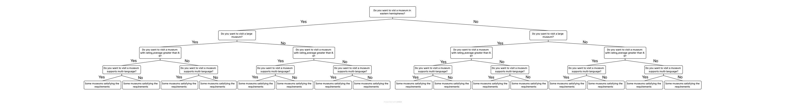

# FindMuseum

## Prerequisite:
(P.S. Prerequisite 1 & 2 are for interactions.)
1. [flask](https://flask.palletsprojects.com/en/2.2.x/): `pip3 install flask`
2. [requests](https://requests.readthedocs.io/en/latest/): `pip3 install requests`
3. Visit the izi travel website(https://www.izi.travel/en/api) to get the database for museums. You can send an email to [support@izi.travel] to receive an API key. You can edit the parameter 'API_KEY' in the file named 'api_key.py' and put your own key.

## Run the code:
1. Download the code.
2. Run 'python3 main.py' and access the link in the terminal (e.g. http://127.0.0.1:5000/)
3. User should answer four questions and then, there are 5 (by default) museums showing on the webpage which satisfying user’s requirements. If user want to find more or less museums, the user can change the number by clicking button next to the number on the webpage. The user can press “reroll” to get another branch of museums meeting the same requirements and “Try again” to change requirements. By clicking the name of the museum, users can also access the google search webpage for the specific museum to find more information.
4. Press CTRL+C to quit.

## Tree structure for data:
We presented our data in Tree pattern:

